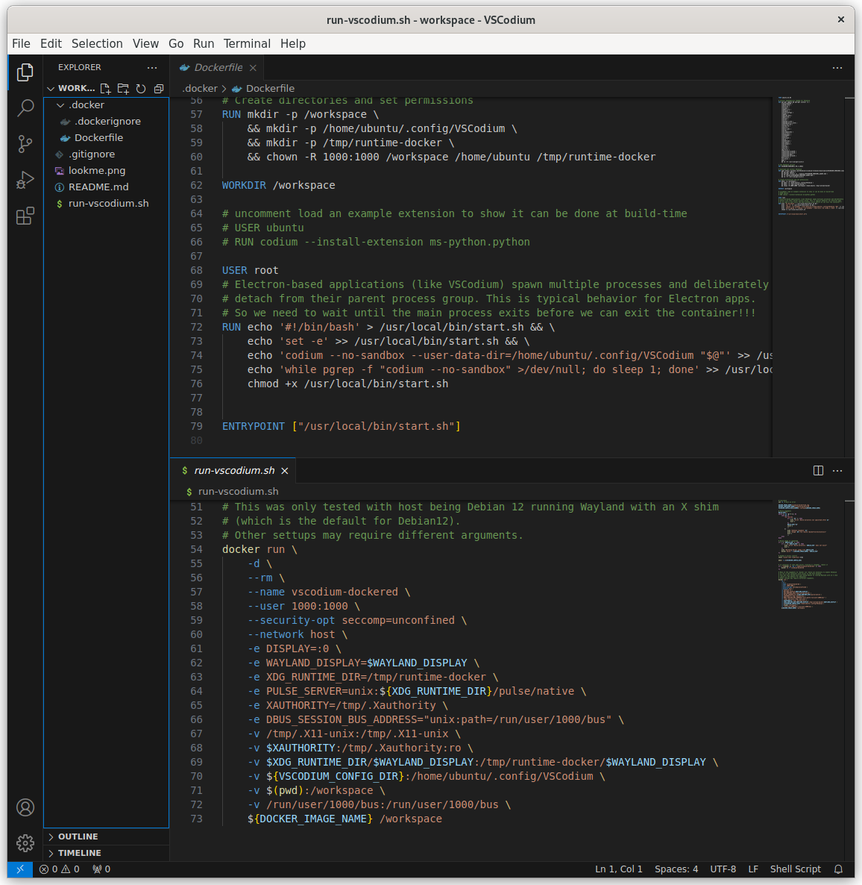

# VSCodium in a Docker Container
------------------------------

## Description

- A Dockerfile for building a Docker image containing VSCodium
- A run-vscodium.sh script for building and running the container on Debian 12
    - Includes specific arguments for display handling

## Requirements

Install Docker and Docker Compose (Note: Only the Docker command is used in the script):
```bash
sudo apt install docker-compose
```

Clone the repository:
```bash
git clone git@github.com:craigphicks/vscodium-dockerfied.git
```

Repository contents:
```bash
├── .docker
│   ├── Dockerfile
│   └── .dockerignore
├── .gitignore
├── README.md
├── lookme.png
└── run-vscodium.sh
```

Two alternative setup methods:
1. Download the repository as a ZIP file and extract it, or
2. Create the directory structure manually and cut and paste the contents of these two files:
    - .docker/Dockerfile
    - run-vscodium.sh

## Usage

Run the script to build and run the container. The container will be automatically removed when VSCodium is closed:
```bash
cd vscodium-dockerfied
./run-vscodium.sh --build .docker
```

VSCodium should launch and appear as shown:



## Persistence of VSCodium Settings

The `run-vscodium.sh` script defines these variables:
```bash
DOCKER_CONTAINER_NAME=vscodium-dockerfied
VSCODIUM_CONFIG_DIR=${HOME}/.config/${DOCKER_CONTAINER_NAME}
```

The configuration directory is mounted in the Docker container using:
```bash
-v ${VSCODIUM_CONFIG_DIR}:/home/ubuntu/.config/VSCodium
```

This mounting ensures VSCodium settings persist between container runs.

## Extension Persistence

Extensions installed during runtime will not persist between container runs, as they are stored in the container's `/usr/share/codium` directory.

To make extensions permanent, install them through the Dockerfile. For example, uncomment these lines in the Dockerfile:
```dockerfile
# USER ubuntu
# RUN codium --install-extension ms-python.python
```

For more information about VSCodium commands, you can access the help while the container is running:

```bash
$ docker exec -it vscodium-dockerfied /bin/bash
ubuntu@debian:/workspace$ vscodium --help
...
```
